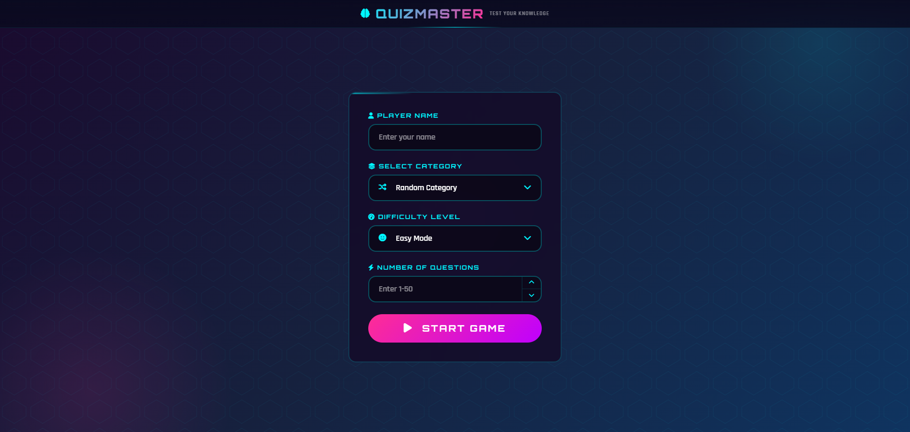
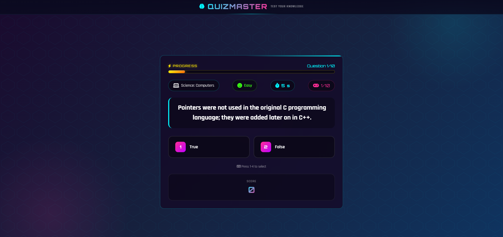
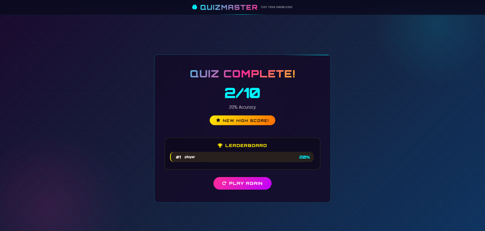

# QuizMaster

A gamified trivia quiz application built with **vanilla JavaScript** and **Object-Oriented Programming**, using the [Open Trivia Database](https://opentdb.com) API. Players choose a category, difficulty, and number of questions, then race against a countdown timer to answer as many questions correctly as possible.

**Live Demo:** (https://shahendamohamed22.github.io/quiz-app/)

## Screenshots





## Features

- Dynamic quiz setup: player name, category, difficulty, and number of questions (custom dropdown UI)
- Questions and answers fetched live from the Open Trivia DB API
- Per-question countdown timer with visual and audio warnings as time runs low
- Keyboard support: press **1–4** to answer, **Enter** to start the game
- Immediate answer feedback (correct/wrong highlighting, correct answer reveal)
- Sound effects for correct/wrong answers, countdown, time-up, and quiz completion
- Persistent leaderboard (stored in `localStorage`) ranking players by accuracy percentage
- Fully responsive, arcade-style neon UI

## How It Works (Core Logic)

The game logic is built around a `Question` class (ES Module) that wraps each raw question object returned by the API:

- Converts the API's snake_case fields (`correct_answer`, `incorrect_answers`) into a clean internal shape
- Shuffles correct and incorrect answers once, at creation time, so the order stays stable per question
- Exposes an `isCorrect(selectedAnswer)` method, so answer-checking logic lives in one place instead of being duplicated across the app

On top of that, `script.js` orchestrates the game flow:

- **`startGame()`** builds the API request from the user's selections, fetches questions, and maps each raw result into a `Question` instance
- **`displayQuestion(index)`** renders the current question and dynamically generates the answer buttons (rebuilding them each round so stale event listeners don't pile up)
- **`counter()`** runs the per-question timer via `setInterval`, adding a "warning" state and countdown sound as time runs low, and auto-revealing the correct answer if time expires
- **`selectAnswer()`** handles answer clicks, checks correctness via `question.isCorrect()`, updates the score, and disables the remaining buttons
- **`nextQuestion()`** advances to the next question or, once the quiz ends, triggers the results screen
- **`addRank()` / `displayResults()`** save the player's score to `localStorage` and render a sorted leaderboard (highest accuracy first) with gold/silver/bronze styling

## Tech Stack

- **HTML5 / CSS3** — custom arcade/neon theme, fully responsive
- **Vanilla JavaScript (ES Modules)** — no frameworks
- **OOP principles** — encapsulation via the `Question` class
- **Open Trivia DB API** — question source
- **localStorage** — leaderboard persistence

## Project Structure
quiz-app/
├── index.html
├── css/
│ └── style.css
├── js/
│ ├── script.js # Main game logic and DOM control
│ ├── questions.js # Question class
│ └── ui-controls.js # Custom dropdown/select UI behavior
└── audio/ # Sound effects

## Getting Started

1. Clone the repository
```bash
   git clone https://github.com/shahendamohamed22/quiz-app.git
```
2. Open `index.html` in a browser (or serve it with a local server like VS Code Live Server, since the project uses ES Modules)
3. No build step or dependencies required

## Author

Built by **Shahenda Mohamed** as part of frontend development practice at Route Academy.